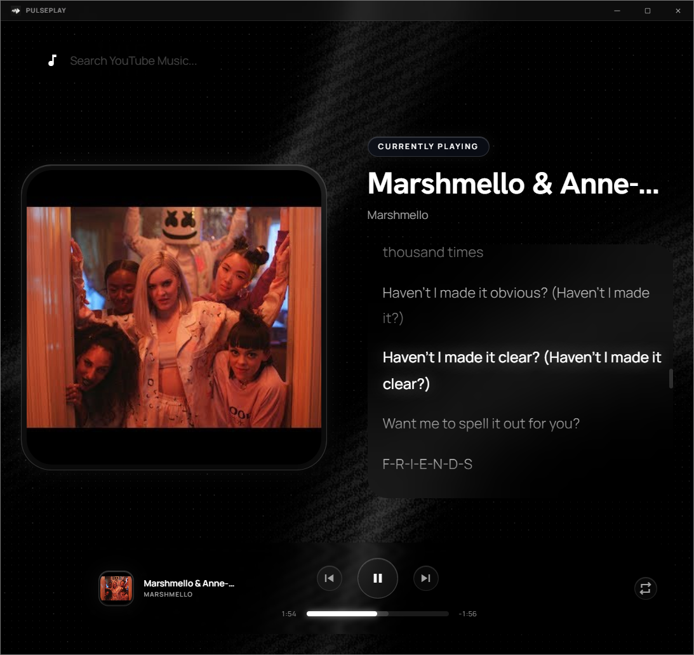

<div align="center">
  
  
  # PulsePlay
  
  **A beautiful, modern desktop music player built with Tauri, React, and the YouTube Music API.**
</div>

## ✨ Features

- **Sleek UI:** Stunning interface built with React, Tailwind CSS, and Liquid Glass.
- **Vast Library:** Powered by the `ytmusic-api` to search and play almost any song.
- **Immersive Visuals:** 3D audio visualizations integrated with `three.js`.
- **Lightweight & Fast:** Uses Tauri for a minimal, highly performant desktop experience.

## 📸 Demo



## ⚠️ Important Note Regarding Network Issues

> [!WARNING]
> PulsePlay relies on YouTube services to fetch and stream songs. If you live in a region where YouTube is blocked or restricted, or if you experience issues such as tracks not loading or searches failing, **please try using a VPN**. Most connection timeouts or empty search results are caused by these regional network restrictions.

## 🚀 Getting Started

### Prerequisites

- [Node.js](https://nodejs.org/) (v18 or higher)
- [Rust & Cargo](https://rustup.rs/) (required for Tauri)

### Installation

1. **Clone the repository:**
   ```bash
   git clone https://github.com/DanialZaree/music-player.git
   cd music-player
   ```

2. **Install dependencies:**
   ```bash
   npm install
   ```

3. **Run in development mode:**
   ```bash
   npm run tauri dev
   ```

4. **Build for production:**
   ```bash
   npm run tauri build
   ```

## 🛠️ Tech Stack

- **Frontend:** React, Tailwind CSS, Liquid Glass
- **Backend/Desktop Platform:** Tauri, Rust
- **Media & Graphics:** React YouTube, Three.js, ytmusic-api
